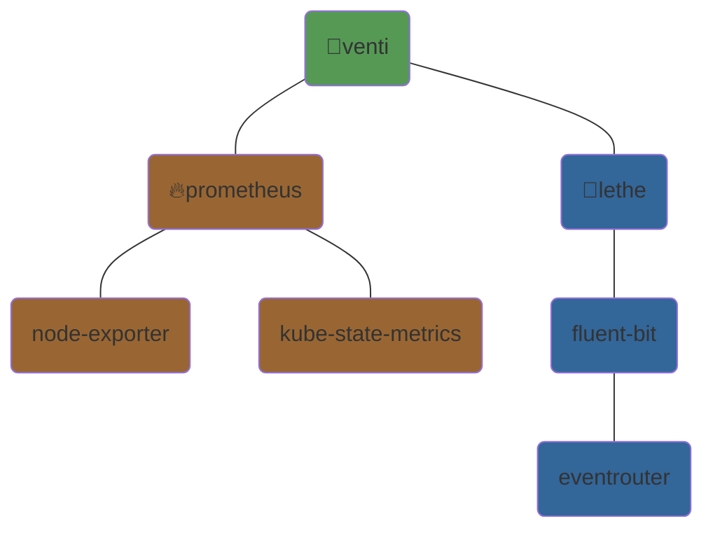

| Component     | Role       | 🖼️ |
| ------------- | ---------- | -- |
| Prometheus    | Metric DB  | 🔥 |
| Lethe         | Log DB     | 🌊 |
| Venti         | Visualizer | 💨 |

```mermaid
graph TD
    Venti("💨venti") --- Prometheus("🔥prometheus") --- NodeExporter("node-exporter")
    Prometheus --- KubeStateMetrics("kube-state-metrics")
    Venti --- Lethe("🌊lethe") --- FluentBit("fluent-bit") --- Eventrouter("eventrouter")

    classDef visual fill:#595;
    classDef metric fill:#963;
    classDef log fill:#369;
    
    class Venti visual
    class Prometheus,NodeExporter,KubeStateMetrics metric
    class Lethe,FluentBit,Eventrouter log
```
